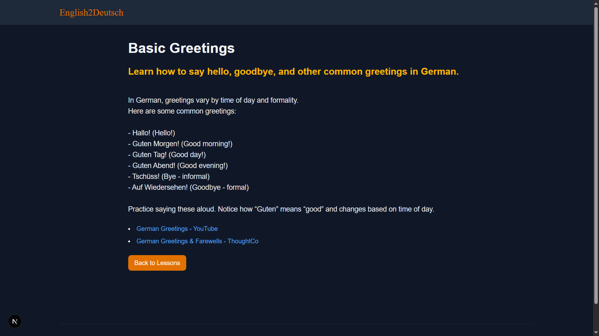

# English2Deutsch

English2Deutsch is a modern web application built with Next.js, TypeScript, and Tailwind CSS designed to help users learn the German language effectively.

---

## Images




## Features

- Interactive German language learning tools
- Clean and responsive UI with Tailwind CSS
- Built with TypeScript for type safety and better developer experience
- Fast and SEO-friendly Next.js framework

---

## Technology Stack

- **Next.js** – React framework for server-side rendering and static site generation
- **TypeScript** – Typed superset of JavaScript
- **Tailwind CSS** – Utility-first CSS framework for styling

---

## Getting Started

### Prerequisites

- Node.js (v14 or higher recommended)
- npm or yarn package manager

### Installation

1. Clone the repository:

```bash
git clone https://github.com/yourusername/english2deutsch.git
cd english2deutsch
```

2. Install dependencies:

npm install
# or
yarn install

3. Run the development server:

npm run dev
# or
yarn dev

4. Open http://localhost:3000 in your browser to start learning German!


## Contributing

    Contributions are welcome! Feel free to open issues or submit pull requests.

## License
    
    This project is licensed under the MIT License.
